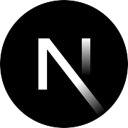

## Welcome to my GitHub! 👩‍💻

####  Greetings

Hey there  

I'm **Tina Azimi**. I am a software engineer specializing in creating engaging animations and micro-interactions with **React**. By utilizing technologies like React, TypeScript, Next.js, Tailwind CSS, Node.js, MongoDB, and GraphQL, I create visually captivating and dynamic websites.

You can contact me via my [LinkedIn](https://www.linkedin.com/in/tina-azimi-197b346b/)

Check out my [Portfolio](https://tinazimi.tech)
#### Tech Stack

<table>
  <tr style="background-color: transparent;">
    <td align="center"></td>
    <td align="center"></td>
    <td align="center"></td>
    <td align="center"></td>
    <td align="center"></td>
  </tr>
  <tr style="background-color: transparent;">
    <td align="center"></td>
    <td align="center"></td>
    <td align="center"></td>
    <td align="center"></td>
    <td align="center"></td>
  </tr>
</table>

<!--
**azimitina/azimitina** is a ✨ _special_ ✨ repository because its `README.md` (this file) appears on your GitHub profile.

Here are some ideas to get you started:

- 🔭 I’m currently working on ...
- 🌱 I’m currently learning ...
- 👯 I’m looking to collaborate on ...
- 🤔 I’m looking for help with ...
- 💬 Ask me about ...
- 📫 How to reach me: ...
- 😄 Pronouns: ...
- ⚡ Fun fact: ...
-->
